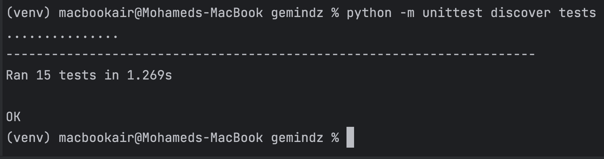

Certainly! Here's the updated README file with all the modifications:

```markdown
# Gemindz Test Application

This is a test application for applying to Gemindz.

## Overview

The Gemindz Test Application is a Flask-based web application designed to demonstrate various functionalities, including user authentication, recording execution results, managing test cases, and logging requests. It provides a platform for testing and evaluating software features in a controlled environment.

## Technologies Used

The Gemindz Test Application utilizes the following technologies:

- Flask: A lightweight web framework for Python.
- Flask-JWT-Extended: Flask extension for JSON Web Token (JWT) authentication.
- Flask-SQLAlchemy: Flask extension for SQL database integration.
- SQLite: A lightweight relational database management system.
- unittest: Python's built-in testing framework for unit tests.
- Coverage: A tool for measuring code coverage of Python programs.

## Instructions to Run the App

To run the Gemindz Test Application locally, follow these steps:

1. Ensure that Python 3.x is installed on your system.

2. Clone this repository to your local machine using:
```

git clone https://github.com/your_username/gemindz-test-app.git

```

3. Navigate to the project directory:

```

cd gemindz-test-app

```

4. Install the required dependencies:

```

pip install -r requirements.txt

```

5. Set up the Flask application by running:

```

export FLASK_APP=app.py
export FLASK_ENV=development

```

6. Initialize the SQLite database:

```

flask init-db

```

7. Run the Flask application:

```

flask run

````

8. Open your web browser and visit [http://localhost:5000](http://localhost:5000) to access the application.

## Unit Testing

The Gemindz Test Application includes comprehensive unit tests to ensure the correctness and reliability of the codebase. These tests cover various aspects of the application, including authentication, execution results recording, test cases management, and more.

### Running Unit Tests

To run the unit tests locally, follow these steps:

1. Ensure that all dependencies are installed by running:

 ```
 pip install -r requirements.txt
 ```

2. Navigate to the project directory in your terminal.

3. Execute the following command to run the unit tests:

 ```
 python -m unittest discover -s tests
 ```

This command will automatically discover and run all test cases located in the `tests` directory.

4. After the tests finish running, you will see the summary output indicating the number of tests run, successes, failures, and errors.

### Test Coverage

Test coverage is an essential metric to assess the effectiveness of unit tests in covering the codebase. This project utilizes coverage measurement tools to monitor test coverage and ensure that critical parts of the code are adequately tested.

To measure test coverage, execute the following command:

````

coverage run -m unittest discover -s tests

```

After running the tests, generate a coverage report by running:

```

coverage report

```

This report will provide detailed information about which parts of the code are covered by unit tests and which parts require additional testing.

### Screenshot of Running Unit Testing

Below is a screenshot showing the execution of unit tests:



## Creator

The Gemindz Test Application was created by Mohamed Ali.

```
